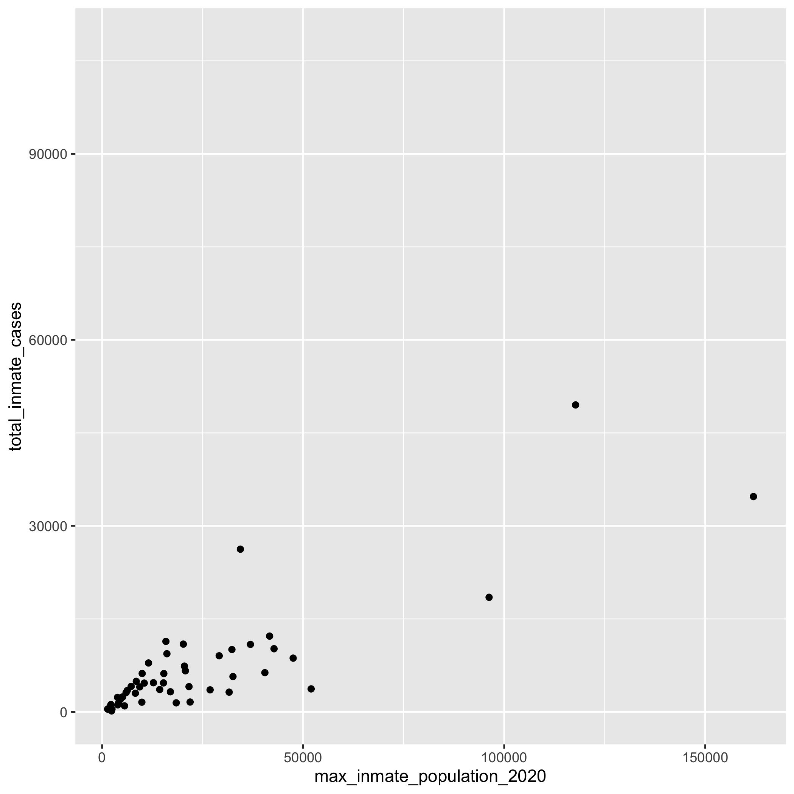
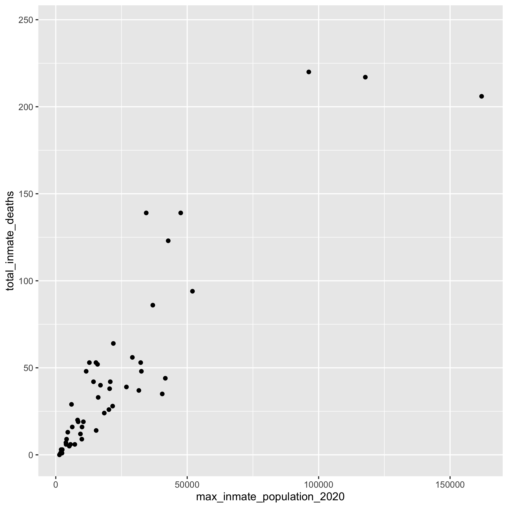
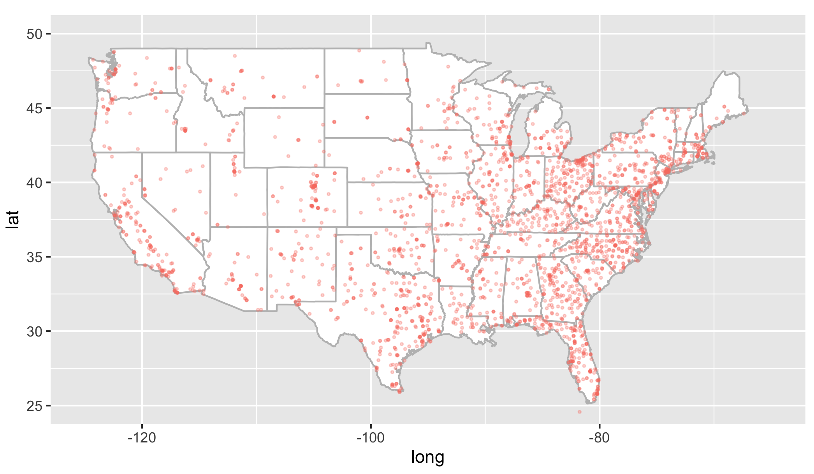
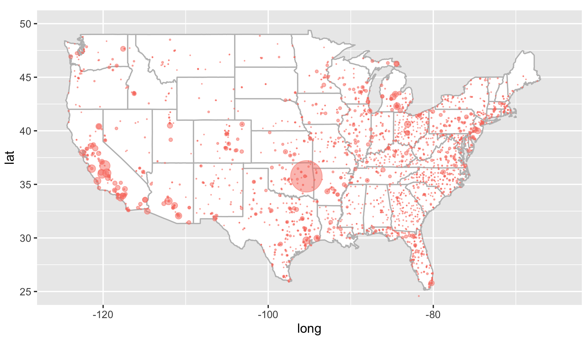
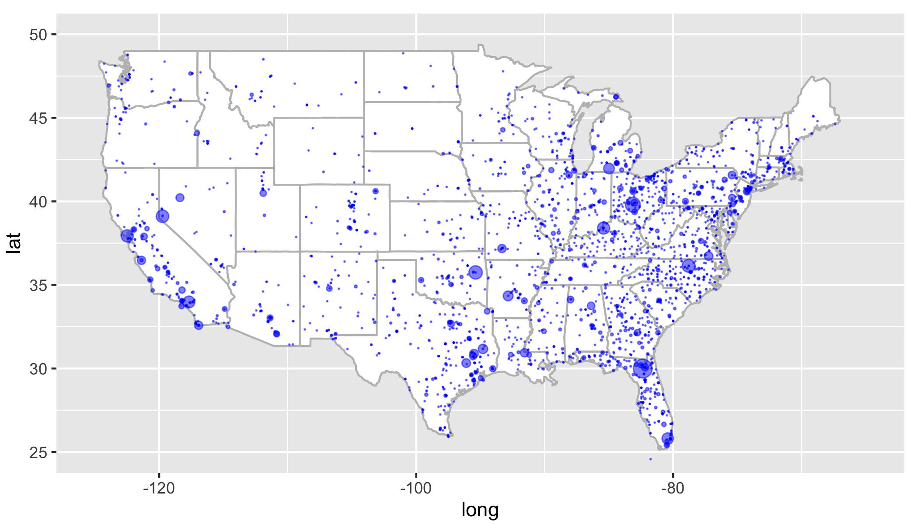

## 1. Main data sets included

- State level cumulative cases and deaths (Jan 2020 - current)

- County level cumulative cases and deaths (Jan 2020 - current)

- Incidence of COVID-19 in prison populations (May 2021)

- Incidence of COVID-19 at educational institutions (May 2021)


<br><br>

### 1.1 Import data into R

```r
library(tidyverse)
cd data/nytimes/
```

```r
counties <- read_csv("us-counties.csv")

cols(
  date = col_date(format = ""),
  county = col_character(),
  state = col_character(),
  fips = col_character(),
  cases = col_double(),
  deaths = col_double()
)
```

```r
states <- read_csv("us-states.csv")

cols(
  date = col_date(format = ""),
  state = col_character(),
  fips = col_character(),
  cases = col_double(),
  deaths = col_double()
)
```

```
prisonfac <- read_csv("prisons/facilities.csv")

cols(
  nyt_id = col_character(),
  facility_name = col_character(),
  facility_type = col_character(),
  facility_city = col_character(),
  facility_county = col_character(),
  facility_county_fips = col_character(),
  facility_state = col_character(),
  facility_lng = col_double(),
  facility_lat = col_double(),
  latest_inmate_population = col_double(),
  max_inmate_population_2020 = col_double(),
  total_inmate_cases = col_double(),
  total_inmate_deaths = col_double(),
  total_officer_cases = col_double(),
  total_officer_deaths = col_double(),
  note = col_character()
)
```

```r
prisonstate <- read_csv("prisons/systems.csv")

cols(
  system = col_character(),
  inmate_tests = col_double(),
  total_inmate_cases = col_double(),
  total_inmate_deaths = col_double(),
  latest_inmate_population = col_double(),
  max_inmate_population_2020 = col_double(),
  total_officer_cases = col_double(),
  total_officer_deaths = col_double()
)
```

<br><Br>

### 1.2 Exploratory analysis

- Max number of cases by state up to June 2021

```r
state_max_cases <- states %>% group_by(state) %>% summarize(max(cases)) %>% arrange(desc(`max(cases)`)) %>% print(n=Inf)

   state                    `max(cases)`
   <chr>                           <dbl>
 1 California                    3808577
 2 Texas                         2979672
 3 Florida                       2329859
 4 New York                      2110069
 5 Illinois                      1392733
 6 Pennsylvania                  1214901
 7 Ohio                          1108902
 8 Georgia                       1106604
 9 New Jersey                    1021182
10 North Carolina                1010919
11 Michigan                       996624
12 Arizona                        889727
13 Tennessee                      853104
14 Indiana                        754583
15 Massachusetts                  709395
16 Virginia                       678649
17 Wisconsin                      676885
18 Missouri                       626338
19 Minnesota                      604602
20 South Carolina                 595448
21 Colorado                       557005
22 Alabama                        548657
23 Louisiana                      477453
24 Kentucky                       464335
25 Maryland                       461956
26 Oklahoma                       455535
27 Washington                     449170
28 Utah                           411680
29 Iowa                           373101
30 Connecticut                    348665
31 Arkansas                       345605
32 Nevada                         328875
33 Mississippi                    319948
34 Kansas                         318104
35 Nebraska                       223986
36 Oregon                         206777
37 New Mexico                     204698
38 Idaho                          194084
39 Puerto Rico                    173328
40 West Virginia                  163382
41 Rhode Island                   152383
42 South Dakota                   124393
43 Montana                        113275
44 North Dakota                   110598
45 Delaware                       109548
46 New Hampshire                   99254
47 Alaska                          70285
48 Maine                           68826
49 Wyoming                         61490
50 District of Columbia            49243
51 Hawaii                          36036
52 Vermont                         24360
53 Guam                             9236
54 Virgin Islands                   3752
55 Northern Mariana Islands          183

```


<br>

- Max number of deaths by state up to June 2021

```r
states_max_deaths <- states %>% group_by(state) %>% summarize(max(deaths)) %>% arrange(desc(`max(deaths)`)) %>% print(n=Inf)

# A tibble: 55 x 2
   state                    `max(deaths)`
   <chr>                            <dbl>
 1 California                       63339
 2 New York                         53026
 3 Texas                            52292
 4 Florida                          37555
 5 Pennsylvania                     27621
 6 New Jersey                       26374
 7 Illinois                         25566
 8 Michigan                         20848
 9 Georgia                          20628
10 Ohio                             20166
11 Massachusetts                    17971
12 Arizona                          17843
13 Indiana                          13795
14 North Carolina                   13359
15 Tennessee                        12415
16 Virginia                         11351
17 Alabama                          11306
18 Louisiana                        10688
19 Missouri                          9846
20 South Carolina                    9792
21 Maryland                          9707
22 Connecticut                       8270
23 Wisconsin                         8047
24 Minnesota                         7638
25 Mississippi                       7371
26 Oklahoma                          7354
27 Kentucky                          7227
28 Colorado                          6876
29 Iowa                              6114
30 Washington                        5894
31 Arkansas                          5874
32 Nevada                            5649
33 Kansas                            5163
34 New Mexico                        4318
35 West Virginia                     2863
36 Oregon                            2784
37 Rhode Island                      2724
38 Puerto Rico                       2540
39 Nebraska                          2519
40 Utah                              2330
41 Idaho                             2125
42 South Dakota                      2027
43 Delaware                          1683
44 Montana                           1651
45 North Dakota                      1554
46 New Hampshire                     1367
47 District of Columbia              1141
48 Maine                              854
49 Wyoming                            734
50 Hawaii                             510
51 Alaska                             356
52 Vermont                            256
53 Guam                               140
54 Virgin Islands                      30
55 Northern Mariana Islands             2
```


<br><br>

- Max number of cases by county

```r
max_county_cases <- counties %>% group_by(county) %>% summarize(max(cases)) %>% arrange(desc(`max(cases)`))

# A tibble: 1,930 x 2
   county         `max(cases)`
   <chr>                 <dbl>
 1 Los Angeles         1248285
 2 New York City        953928
 3 Maricopa             556844
 4 Cook                 556201
 5 Miami-Dade           501925
 6 Harris               403496
 7 Dallas               305400
 8 Riverside            301603
 9 San Bernardino       299289
10 San Diego            281745
# … with 1,920 more rows
```

<br><br>

- Max number of deaths by county

```r
max_county_deaths <- counties %>% group_by(county) %>% summarize(max(deaths)) %>% arrange(desc(`max(deaths)`))

# A tibble: 1,930 x 2
   county         `max(deaths)`
   <chr>                  <dbl>
 1 New York City          33374
 2 Los Angeles            24454
 3 Cook                   11016
 4 Maricopa               10224
 5 Harris                  6548
 6 Miami-Dade              6472
 7 Wayne                   5142
 8 Orange                  5112
 9 San Bernardino          4844
10 Riverside               4627
# … with 1,920 more rows
```

<br><br>

- Prison data: Proportion of cases and deaths to prison population size (2020) by state


```r
prisonstate

# A tibble: 54 x 8
   system   inmate_tests total_inmate_cas… total_inmate_dea… latest_inmate_popu…
   <chr>           <dbl>             <dbl>             <dbl>               <dbl>
 1 Alabama         15505              1601                64               19144
 2 Alaska          27756              2428                 5                5011
 3 Arizona         43652             12229                44               38248
 4 Arkansas            0             11378                52               14729
 5 Califor…       121207             49511               217              110471
 6 Colorado       193165              9389                33               13346
 7 Connect…        73559              4655                19                8839
 8 Delaware        12665              2020                13                4562
 9 Florida         87677             18491               220               83622
10 Georgia         11947              3717                94               47585
# … with 44 more rows, and 3 more variables: max_inmate_population_2020 <dbl>,
#   total_officer_cases <dbl>, total_officer_deaths <dbl>
```

```r
prison_cases2pop <- prisonstate %>% ggplot() + geom_point(aes(x=max_inmate_population_2020, y=total_inmate_cases))

prison_deaths2pop <- prisonstate %>% ggplot() + geom_point(aes(x=max_inmate_population_2020, y=total_inmate_deaths))
```

<br>

<center>


</center>


<br><br>

- Density of prisons across the United States

```r
usamap <- map_data('usa')
statesmap <- map_data('state')

usa_base <- ggplot(data=statesmap) + geom_polygon(aes(x=long, y=lat, fill=I("white"), group=group), color="gray") + coord_fixed(1.3) + guides(fill="none")

usa_base + geom_point(data=prisonfac, aes(x=facility_lng, y=facility_lat), color="salmon", cex=0.5, alpha=3/10) + coord_fixed(xlim=c(-125, -65), ylim=c(25,50), ratio=1.3)
```

<br>

<center>

</center>


<br>

- COVID-19 cases among prisoners across the US


```r
usa_base + geom_point(data=prisonfac, aes(x=facility_lng, y=facility_lat), color="salmon", cex=prisonfac$total_inmate_cases/1000, alpha=5/10) + coord_fixed(xlim=c(-125, -65), ylim=c(25,50), ratio=1.3)
```

<br>
<center>

</center>
<br>


- COVID-19 deaths among prisoners across the US

```r
usa_base + geom_point(data=prisonfac, aes(x=facility_lng, y=facility_lat), color="blue", cex=prisonfac$total_inmate_deaths/10, alpha=5/10) + coord_fixed(xlim=c(-125, -65), ylim=c(25,50), ratio=1.3)
```

<br>
<center>

</center>
<br>


